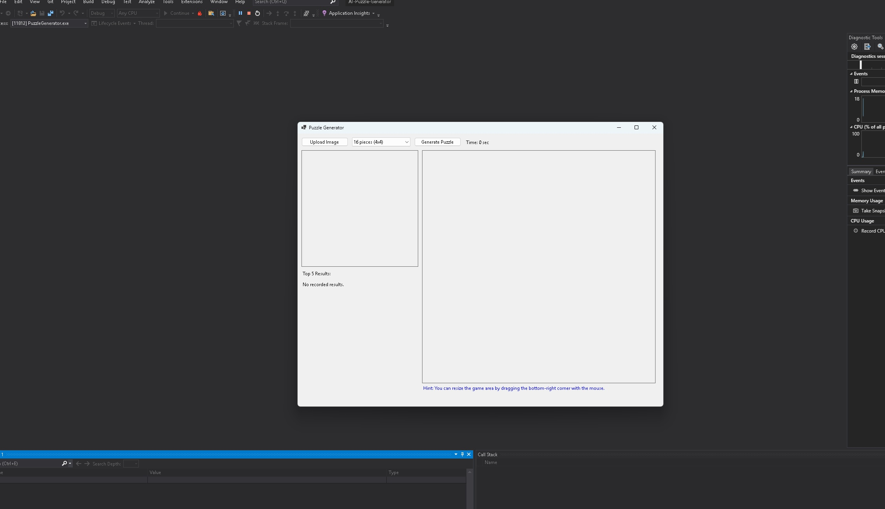
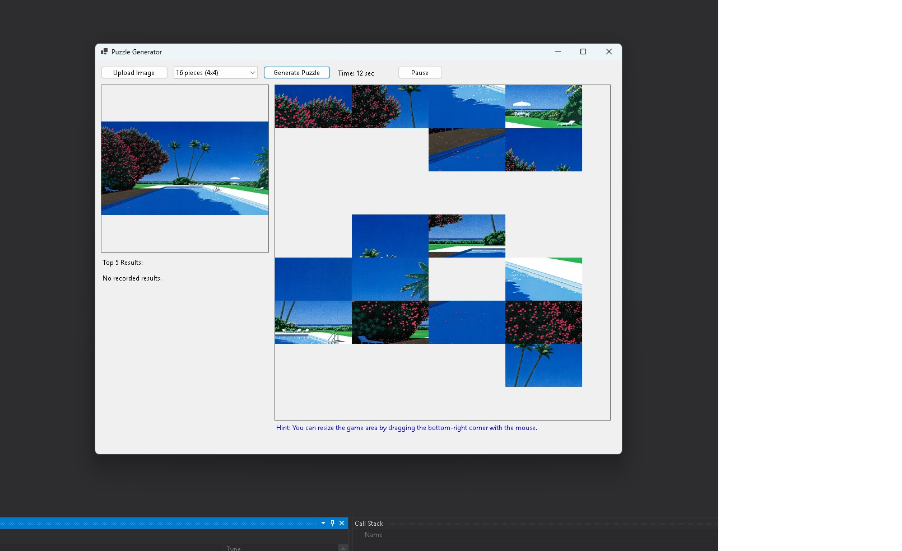
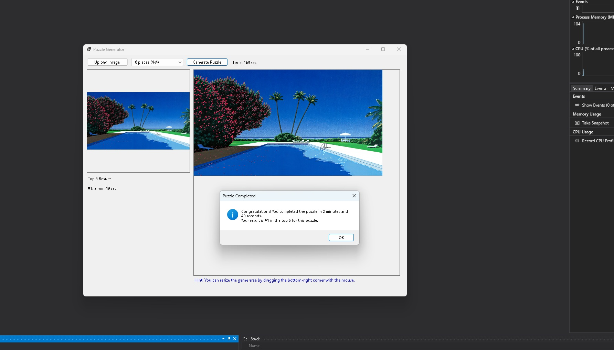

# SoftUni AI-Assisted Development Exam Report: AI Puzzle Generator

## Project Idea and Requirements

AI Puzzle Generator is a C# Windows Forms desktop application that creates a puzzle from a user-selected image. The user can upload an image, choose a puzzle size, generate pieces, drag and connect them, pause the game, and save top completion times.

The project is presented as an AI-assisted mini-app developed iteratively with Codex as the main implementation and refactoring tool. ChatGPT was used for planning, prompt design, review, and exam alignment.

Main requirements:

- Keep the application as a C# Windows Forms desktop project.
- Preserve the gameplay behavior.
- Support image upload, preview, puzzle generation, dragging, snapping, keyboard movement, pause/resume, timer, completion detection, and top-time persistence.
- Organize the project into clear modules suitable for a small exam submission.
- Document the development process, testing strategy, AI tools used, and working system evidence.

Repository: [https://github.com/Magistus81/AI-Puzzle-Generator](https://github.com/Magistus81/AI-Puzzle-Generator)

## System Architecture – Modules

The application uses a simple WinForms architecture. Most interactive gameplay remains in the form because the logic depends on `PictureBox` controls, mouse events, keyboard events, and WinForms timers.

- UI Layer: `PuzzleForm` creates the form controls, handles events, displays the image preview, shows the timer, and updates top-time labels.
- Image Processing and Puzzle Generation: the uploaded image is scaled to the puzzle area, split into equal rectangular pieces, and assigned correct grid positions.
- Puzzle Piece Movement and Snapping Logic: pieces are dragged with the mouse, connected pieces move as groups, nearby adjacent pieces snap together, and correctly placed groups are locked.
- Game State, Timer and Pause/Resume: the form tracks active and paused states, updates elapsed time, and hides puzzle pieces while paused.
- Score Persistence: `ScoreService` loads and saves the best five completion times per puzzle size in `TopTimes.json`.
- Testing and Validation: validation is manual, supported by build checks and screenshots of the working app.

## Development Process per Module

### UI Layer

Approach and reasoning: The UI was kept as a straightforward WinForms interface because the exam goal is a functional desktop mini-app, not a visual redesign. Controls are created in `PuzzleForm`, and the layout remains simple and easy to test.

Step-by-step workflow: create the main form, add upload/generate/pause controls, add the preview area, add the puzzle panel, add labels for timer and top times, then connect button, mouse, keyboard, and form-closing events.

Testing strategy: run the app, verify all controls appear, upload an image, generate a puzzle, switch puzzle sizes, pause/resume, and confirm top-time labels update.

AI tool choice: Codex was used for project structuring, WinForms refactoring, and documentation updates. ChatGPT was used to review the project description and align it with exam expectations.

Example prompt or interaction: "Keep this as a C# WinForms application, preserve behavior, and organize the project into a clean Visual Studio structure."

### Image Processing and Puzzle Generation

Approach and reasoning: The image is resized to fit the puzzle panel while keeping its aspect ratio. It is then split into rows and columns based on the selected puzzle size. Each generated piece keeps its image, correct position, and grid position.

Step-by-step workflow: read the selected puzzle size, scale the uploaded bitmap, calculate piece width and height, clone rectangular image sections, create `PictureBox` controls, create `PuzzlePiece` objects, and shuffle/display them.

Testing strategy: upload different image sizes, generate 3x3, 4x4, 5x5, 8x8, and 10x10 puzzles, and visually verify that pieces are created and displayed.

AI tool choice: Codex helped keep the generation logic inside the form while separating the `PuzzlePiece` and `PuzzleGroup` models for clearer structure.

Example prompt or interaction: "Move the puzzle model classes into separate files, but keep the puzzle generation behavior unchanged."

### Puzzle Piece Movement and Snapping Logic

Approach and reasoning: Pieces are moved with mouse drag events. When pieces are adjacent in the grid and close enough on screen, their groups are merged. Correctly placed groups snap to their final positions and become locked.

Step-by-step workflow: detect mouse down on a piece, store the selected piece, bring its group to the front, calculate movement delta during dragging, move the whole group, check for adjacent pieces on mouse up, merge groups if needed, then check placement.

Testing strategy: drag individual pieces, snap two adjacent pieces, drag connected groups, place a group near its correct position, and verify locked pieces cannot be moved.

AI tool choice: Codex helped add the stabilization fix for visual flickering while preserving the existing PictureBox-based rendering approach.

Example prompt or interaction: "Reduce flickering when dragging connected puzzle pieces by using a double-buffered panel and batched group movement updates without rewriting rendering."

### Game State, Timer and Pause/Resume

Approach and reasoning: A WinForms timer tracks elapsed seconds while the game is active. Pause/resume is handled by stopping or restarting the timer and hiding or showing puzzle pieces.

Step-by-step workflow: start the timer after puzzle generation, update the timer label each second, pause by stopping the timer and hiding pieces, resume by showing pieces and restarting the timer, then stop the timer when the puzzle is complete.

Testing strategy: generate a puzzle, verify the timer increments, pause and confirm pieces are hidden and time stops, resume and confirm pieces return and time continues.

AI tool choice: Codex helped extract repeated time formatting into `TimeFormatter` while leaving the game state behavior in `PuzzleForm`.

Example prompt or interaction: "Extract time display formatting into a helper while preserving the timer and pause/resume behavior."

### Score Persistence

Approach and reasoning: Scores are stored locally because the project does not need accounts, cloud storage, or a database. `ScoreService` uses Newtonsoft.Json to load and save the best five times for each puzzle size.

Step-by-step workflow: load existing top times at startup, update the current puzzle size list when a puzzle is completed, sort times, keep only the best five, save the JSON file, and refresh the displayed labels.

Testing strategy: complete a small puzzle, verify `TopTimes.json` is created or updated, close and reopen the app, and confirm saved times are displayed.

AI tool choice: Codex helped separate score persistence from UI logic while keeping the JSON-based behavior simple and transparent.

Example prompt or interaction: "Extract JSON top-times logic into a service and keep the same local file persistence behavior."

### Testing and Validation

Approach and reasoning: The project depends heavily on visual and interactive behavior, so manual testing is the honest primary validation method. Build validation is used to confirm the Visual Studio project compiles.

Step-by-step workflow: build the solution, run the app, follow the manual checklist, capture screenshots, check score persistence, and review documentation for exam readiness.

Testing strategy: no automated UI tests were added. Manual checks cover upload, generation, movement, snapping, pause/resume, completion, and saved top times.

AI tool choice: Codex helped prepare the manual checklist, build/run instructions, documentation, and final cleanup. ChatGPT supported prompt planning and review of exam structure.

Example prompt or interaction: "Prepare a concise manual testing checklist and make the report suitable for the SoftUni AI-Assisted Development exam."

## Testing Strategy

Manual test checklist:

- Upload a valid image.
- Try generating without an image.
- Generate each puzzle size: 3x3, 4x4, 5x5, 8x8, and 10x10.
- Drag individual pieces.
- Drag connected groups.
- Use keyboard arrow keys to move the last selected piece.
- Pause and resume the game.
- Complete a small 3x3 puzzle.
- Verify `TopTimes.json` is created or updated.
- Close and reopen the app and verify top times are loaded.

Build validation:

- Open the solution in Visual Studio and build it.
- Run `dotnet build` from the command line.

No automated tests are claimed for this project. The main validation method is manual testing because the core behavior is interactive WinForms UI behavior.

## Challenges and Tool Comparison

The main challenge was preserving gameplay behavior while improving project structure and documentation. A large rewrite would have increased risk, so the final design keeps the UI and puzzle interaction logic close to the WinForms controls.

Another challenge was visual flickering while dragging connected puzzle pieces. The issue was reduced by using a custom double-buffered puzzle panel and batching group movement updates with layout suspension. This avoids a full custom rendering rewrite while improving the visible dragging behavior.

Codex was the main tool for implementation support, project structuring, refactoring, documentation, build validation, and the flicker reduction fix. ChatGPT was used for planning, prompt design, review, and exam alignment.

Tool comparison:

- Codex was best for working directly with the repository, editing files, applying refactors, and checking build results.
- ChatGPT was useful for planning, improving prompts, reviewing explanations, and making the report match the SoftUni exam format.
- Manual testing was still necessary because AI tools cannot fully verify visual dragging, snapping, and pause/resume behavior without the user checking the running desktop app.

## Working System Evidence

Screenshots are included in the repository:

These screenshots show the application running, puzzle generation, and a completed puzzle state. Additional evidence can include a local build result and a short manual testing screen recording if required by the exam submission process.

## Repository Link

[https://github.com/Magistus81/AI-Puzzle-Generator](https://github.com/Magistus81/AI-Puzzle-Generator)
